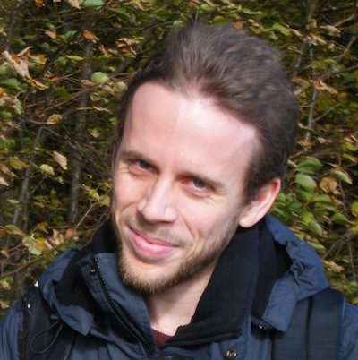

### Curriculum Vitae

#### Personal data

*    Name: David Waller
*    Born: 1979-07-20
*    Email: [david@krawaller.se](mailto:david@krawaller.se)
*    Blog: [http://blog.krawaller.se](http://blog.krawaller.se)
*    Address: Stävgatan 3E, 27152 Ystad, Sweden

#### Academic merits

*    Teacher of mathematics and Swedish, 5 years @ [Halmstad university](http://www.hh.se)
*    Web programmer, 3 years @ [Linnaeus university](http://lnu.se)
*    Highest grade on the [Swedish SAT](http://en.wikipedia.org/wiki/Swedish_Scholastic_Aptitude_Test)

#### Work merits

*    Teacher of advanced JavaScript and RIA creation for Linnaeus University, 2010-present
*    Teacher of mathematics, Swedish and programming (with a generous blend of IT development) for the [Swedish Prison and Probation Service](http://www.kriminalvarden.se/swedish-prison-and-probation-service), 2007-present
*    Sheep slaughterer at [Fjällalamb, Iceland](http://fjallalamb.is/), 2005-2007
*    Teacher of mathematics and Swedish at Tjörns utbildningscenter, 2003-2005

#### Technical merits

Earlier backend skills have been all but replaced by a semi-religious embracement of the web stack. Focus used to be Backbone, now shifted to React. A selection of deeds:

*    Creator of [Algebra Explorer](http://www.algebraexplorer.com) 2014
*    Speaker (about CoffeeScript) at [Software Passion Summit](http://lanyrd.com/2012/software-passion-summit/) 2012
*    Appcelerator [Titanium Certified Developer](https://training.appcelerator.com/assets/datasheet/tcd-certification-objectives.pdf) 2011
*    Developer of [DBT Self help app](https://itunes.apple.com/se/app/dbt-self-help/id458300012?mt=8) 2011
*    Creator of [Tristania's official band app](https://itunes.apple.com/se/app/tristania/id396749076?mt=8) 2010

#### References

*    Principal at the Swedish Prison and Probation Service; [Lena Broo](mailto:lena.broo@kriminalvarden.se)
*    Head of the Web programmer programme at Linnaeus University; [Johan Leitet](https://www.linkedin.com/in/leitet)
*    [Doug Crockford](http://crockford.com) said my CoffeeScript talk was excellent and that he agreed with everything I said. Merit or not...

#### Also

Singing, LEGO and black metal! And travel, but mainly as an excuse for [photo bombing](bomb.JPG).